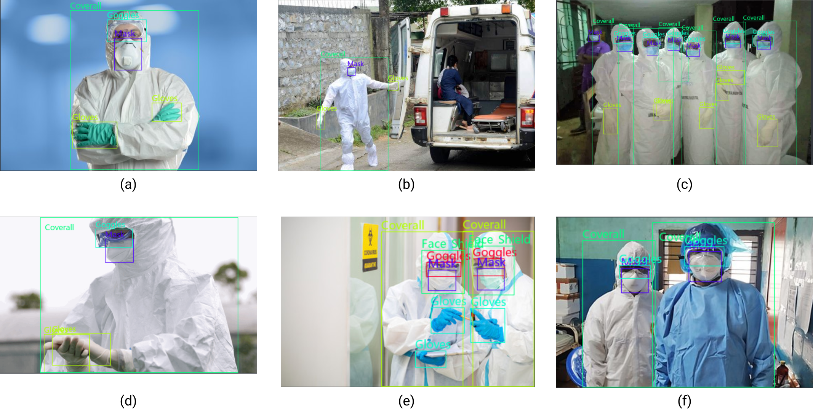

# CPPE - 5 [](https://twitter.com/intent/tweet?text=Wow:&url=https%3A%2F%2Fgithub.com%2FRishit-dagli%2Fhttps://github.com/Rishit-dagli/CPPE-Dataset)


[](https://github.com/psf/black)

CPPE - 5 (Medical Personal Protective Equipment) is a new challenging dataset
with the goal to allow the study of subordinate categorization of medical
personal protective equipments, which is not possible with other popular data
sets that focus on broad level categories.

Some features of this dataset are:
- high quality images and annotations (~4.6 bounding boxes per image)
- real-life images unlike any current such dataset
- majority of non-iconic images (allowing easy deployment to real-world environments)
- \>15 pre-trained models in the model zoo availaible to directly use (also for mobile and edge devices)



## Get the data

We strongly recommend you use either the downlaoder script or the Python package
to download the dataset however you could also download and extract it manually.

| Name | Size | Drive | Bucket | MD5 checksum |
|:----:|:----:|:----:|:----:|:------------:|
| `dataset.tar.gz` | ~230 MB | [Download](https://drive.google.com/file/d/1MGnaAfbckUmigGUvihz7uiHGC6rBIbvr/view?usp=sharing) | [Download](https://storage.googleapis.com/cppe-5/dataset.tar.gz) | `f4e043f983cff94ef82ef7d57a879212` |

### Downloader Script

The easiest way to download the dataset is to use the downloader script:

```bash
git clone https://github.com/Rishit-dagli/CPPE-Dataset.git
cd CPPE-Dataset
bash tools/download.sh
```

### Python package

You can also use the Python package to get the dataset:

```bash
pip install cppe5
```

```python
import cppe5
cppe5.download_data()
```

## Labels

The dataset contains the following labels:

| Label | Description |
|:----:|:-------------|
| 1 | Coverall |
| 2 | Face_Shield |
| 3 | Gloves |
| 4 | Goggles |
| 5 | Mask |

## Model Zoo

More about the pre-trained models could be found in [MODEL_ZOO.md](MODEL_ZOO.md)
and [LITE_MODEL_ZOO.md](LITE_MODEL_ZOO.md) includes models ready for deployment
on mobile and edge devices.

### Baseline Models

This section contains the baseline models that are trained on the CPPE-5 dataset
. More information about how these are trained could be found in the original
paper and the config files.

|   Method    | AP<sup>box</sup> | AP<sub>50</sub><sup>box</sup> | AP<sub>75</sub><sup>box</sup> | AP<sub>S</sub><sup>box</sup> | AP<sub>M</sub><sup>box</sup> | AP<sub>L</sub><sup>box</sup> | Configs | TensorBoard.dev | PyTorch model | TensorFlow model |
|:-----------:|:--------------------------:|:---------------------------------------:|:---------------------------------------:|:----------------------------------------:|:----------------------------------------:|:----------------------------------------:|:-------:|:------:|:-------:|:------:|
|     SSD     |           29.50            |                  57.0                   |                  24.9                   |                   32.1                   |                   23.1                   |                   34.6                   | [config](baselines/ssd.config) | [tb.dev](https://tensorboard.dev/experiment/2EimzQz9Q4GCJjYsyo1MKQ/) | [bucket]() | [bucket](https://storage.googleapis.com/cppe-5/trained_models/ssd/tf_ssd.tar.gz) |
|    YOLO     |            38.5            |                  79.4                   |                  35.3                   |                   23.1                   |                   28.4                   |                   49.0                   | [config](baselines/yolov3_d53_mstrain-608_273e_coco.py) | [tb.dev](https://tensorboard.dev/experiment/5JrpU22hRnOOOXCLKvxFyQ) | [bucket](https://storage.googleapis.com/cppe-5/trained_models/yolo/yolov3_d53_608_273e-2942d1ca.pth) | [bucket](https://storage.googleapis.com/cppe-5/trained_models/yolo/yolo.tar.gz) |
| Faster RCNN |            44.0            |                  73.8                   |                  47.8                   |                   30.0                   |                   34.7                   |                   52.5                   | [config](baselines/faster_rcnn_r101_fpn_2x_coco.py) | [tb.dev](https://tensorboard.dev/experiment/20XQ37HgQUyMJuOlbqmVDQ/) | [bucket](https://storage.googleapis.com/cppe-5/trained_models/faster_rcnn/faster_rcnn_r101_fpn_2x_coco-77efa99b.pth) | [bucket](https://storage.googleapis.com/cppe-5/trained_models/faster_rcnn/faster_rcnn.tar.gz) |

### SoTA Models

This section contains the SoTA models that are trained on the CPPE-5 dataset
. More information about how these are trained could be found in the original
paper and the config files.


|           Method           | AP<sup>box</sup> | AP<sub>50</sub><sup>box</sup> | AP<sub>75</sub><sup>box</sup> | AP<sub>S</sub><sup>box</sup> | AP<sub>M</sub><sup>box</sup> | AP<sub>L</sub><sup>box</sup> | Configs | TensorBoard.dev                                                      | PyTorch model                                                                                                                                  | TensorFlow model                                                                               |
|:--------------------------:|:----------:|:-----------------:|:-----------------:|:----------------:|:----------------:|:----------------:|:------------:|:----------------------------------------------------------------------:|:------------------------------------------------------------------------------------------------------------------------------------------------:|:------------------------------------------------------------------------------------------------:|
|         RepPoints          |    43.0    |        75.9       |        40.1       |       27.3       |       36.7       |       48.0       | [config](configs/reppoints_moment_r50_fpn_gn_2x_coco.py) | [tb.dev](https://tensorboard.dev/experiment/Co6JQVe1RDmxgbMx4gD0Qg/) | [bucket](https://storage.googleapis.com/cppe-5/trained_models/reppoints/reppoints_moment_r50_fpn_gn_2x_coco-18beef36.pth)                      |                                                -                                               |
|        Sparse RCNN         |    44.0    |        69.6       |        44.6       |       30.0       |       30.6       |       54.7       | [config](configs/sparse_rcnn_r101_fpn_300_proposals_crop_mstrain_480-800_3x_coco.py) | [tb.dev](https://tensorboard.dev/experiment/se3w7zQ7SlyE6T8q59P79w/) | [bucket](https://storage.googleapis.com/cppe-5/trained_models/sparse_rcnn/sparse_rcnn_r101_fpn_300_proposals_crop_mstrain_480-800_3x_coco.pth) |                                                -                                               |
|            FCOS            |    44.4    |        79.5       |        45.9       |       36.7       |       39.2       |       51.7       | [config](configs/fcos_r101_caffe_fpn_gn-head_mstrain_640-800_2x_coco.py) | [tb.dev](https://tensorboard.dev/experiment/O343s1kRQIKTqs508jESDA/) | [bucket](https://storage.googleapis.com/cppe-5/trained_models/fcos/fcos_r101_caffe_fpn_gn-head_mstrain_640-800_2x_coco-031dc428.pth)           | [bucket](https://storage.googleapis.com/cppe-5/trained_models/fcos/tf_fcos.tar.gz)             |
|         Grid RCNN          |    47.5    |        77.9       |        50.6       |       43.4       |       37.2       |       54.4       | [config](configs/grid_rcnn_x101_64x4d_fpn_gn-head_2x_coco.py) | [tb.dev](https://tensorboard.dev/experiment/fgGkJ4IBSZmDQj1QEKgXqA/) | [bucket](https://storage.googleapis.com/cppe-5/trained_models/grid_rcnn/grid_rcnn_x101_64x4d_fpn_gn-head_2x_coco-65319c19.pth)                 |                                                -                                               |
|      Deformable DETR       |    48.0    |        76.9       |        52.8       |       36.4       |       35.2       |       53.9       | [config](configs/deformable_detr_refine_r50_16x2_50e_coco.py) | [tb.dev](https://tensorboard.dev/experiment/uq80boznQY2iJVhWSXAKTw/) | [bucket](https://storage.googleapis.com/cppe-5/trained_models/deformable_detr/deformable_detr_refine_r50_16x2_50e-d36a2db1.pth)                |                                                -                                               |
|            FSAF            |    49.2    |        84.7       |        48.2       |       45.3       |       39.6       |       56.7       | [config](configs/fsaf_x101_64x4d_fpn_1x_coco.py) | [tb.dev](https://tensorboard.dev/experiment/jUa0QjFJQZe68o4vbP194Q/) | [bucket](https://storage.googleapis.com/cppe-5/trained_models/fsaf/fsaf_x101_64x4d_fpn_1x_coco-7284d216.pth)                                   | [bucket](https://storage.googleapis.com/cppe-5/trained_models/fsaf/tf_fsaf.tar.gz)             |
| Localization Distillation  |    50.9    |        76.5       |        58.8       |       45.8       |       43.0       |       59.4       | [config](configs/ld_r50_gflv1_r101_fpn_coco_1x.py) | [tb.dev](https://tensorboard.dev/experiment/UMGK5cbATVSDZM5DKN1QAA/) | [bucket](https://storage.googleapis.com/cppe-5/trained_models/ld/ld_r50_gflv1_r101_fpn_coco_1x-e12b2422.pth)                                   |                                                -                                               |
|        VarifocalNet        |    51.0    |        82.6       |        56.7       |       39.0       |       42.1       |       58.8       | [config](configs/vfnet_r101_fpn_mdconv_c3-c5_mstrain_2x_coco.py) | [tb.dev](https://tensorboard.dev/experiment/bE7LlxNLRU2nGanjxEs2rg/) | [bucket](https://storage.googleapis.com/cppe-5/trained_models/vfnet/vfnet_r101_fpn_mdconv_c3-c5_mstrain_2x_coco-8d841df9.pth)                  |                                                -                                               |
|           RegNet           |    51.3    |        85.3       |        51.8       |       35.7       |       41.1       |       60.5       | [config](configs/faster_rcnn_regnetx-3.2GF_fpn_2x_coco.py) | [tb.dev](https://tensorboard.dev/experiment/eYyj3lwcR5O3XDbuyFZ81Q/) | [bucket](https://storage.googleapis.com/cppe-5/trained_models/regnet/regnet-4GF-987ef260.pth)                                                  | [bucket](https://storage.googleapis.com/cppe-5/trained_models/regnet/regnet.tar.gz)            |
|        Double Heads        |    52.0    |        87.3       |        55.2       |       38.6       |       41.0       |       60.8       | [config](configs/dh_faster_rcnn_r50_fpn_1x_coco.py) | [tb.dev](https://tensorboard.dev/experiment/cLMEyMJEQPqWXWeW4XpRkA/) | [bucket](https://storage.googleapis.com/cppe-5/trained_models/double_heads/dh_faster_rcnn_r50_fpn_1x_coco-b10cef7a.pth)                        |                                                -                                               |
|            DCN             |    51.6    |        87.1       |        55.9       |       36.3       |       41.4       |       61.3       | [config](configs/faster_rcnn_r50_fpn_mdpool_1x_coco.py) | [tb.dev](https://tensorboard.dev/experiment/GWTGBFo5TruxPlazzkIpXQ/) | [bucket](https://storage.googleapis.com/cppe-5/trained_models/dcn/faster_rcnn_r50_fpn_mdpool_1x_coco-1d85638a.pth)                             |                                                -                                               |
|     Empirical Attention    |    52.5    |        86.5       |        54.1       |       38.7       |       43.4       |       61.0       | [config](configs/) | [tb.dev](https://tensorboard.dev/experiment/56OgPsWLTWe1jhAV1i00iw/) | [bucket](https://storage.googleapis.com/cppe-5/trained_models/empirical_attention/faster_rcnn_r50_fpn_attention_1111_dcn_1x_coco-f69549ae.pth) |                                                -                                               |
|         TridentNet         |    52.9    |        85.1       |        58.3       |       42.6       |       41.3       |       62.6       | [config](configs/tridentnet_r50_caffe_mstrain_3x_coco.py) | [tb.dev](https://tensorboard.dev/experiment/9O0MAFnlRMWWezz1TbLYGQ/) | [bucket](https://storage.googleapis.com/cppe-5/trained_models/tridentnet/tridentnet_r50_caffe_mstrain_3x_coco-eb569217.pth)                    | [bucket](https://storage.googleapis.com/cppe-5/trained_models/tridentnet/tf_tridentnet.tar.gz) |

## Tools

We also include the following tools in this repository to make working with the dataset
a lot easier:

- Download data
- Download TF Record files
- Convert PNG images in dataset to JPG Images
- Converting Pascal VOC to COCO format
- Update dataset to use relative paths

More information about each tool can be found in the
[tools/README.md](tools/README.md) file.

## Tutorials

We also present some tutorials on how to use the dataset in this repository as
Colab notebooks:

- [pytorch_loader.ipynb](notebooks/pytorch_loader.ipynb) <a href="https://colab.research.google.com/github/Rishit-dagli/CPPE-Dataset/blob/main/notebooks/pytorch_loader.ipynb" target="_parent"></a>

In  this notebook we will load the CPPE - 5 dataset in PyTorch and also see a quick example of fine-tuning the Faster RCNN model with `torchvision` on this dataset.

- [tensorflow_loader.ipynb](notebooks/tensorflow_loader.ipynb) <a href="https://colab.research.google.com/github/Rishit-dagli/CPPE-Dataset/blob/main/notebooks/tensorflow_loader.ipynb" target="_parent"></a>

In this notebook we will load the CPPE - 5 dataset through TF Record files in TensorFlow.

- [visualize.ipynb](notebooks/visualize.ipynb) <a href="https://colab.research.google.com/github/Rishit-dagli/CPPE-Dataset/blob/main/notebooks/visualize.ipynb" target="_parent"></a>

In this notebook, we will visualize the CPPE-5 dataset, which could be really helpful to see some sample images and annotations from the dataset.

## Citation

If you use this dataset, please cite the following paper:

[WIP]

## Want to Contribute 🙋‍♂️?

Awesome! If you want to contribute to this project, you're always welcome! See [Contributing Guidelines](CONTRIBUTING.md). You can also take a look at [open issues](https://github.com/Rishit-dagli/CPPE-Dataset/issues) for getting more information about current or upcoming tasks.

## Want to discuss? 💬

Have any questions, doubts or want to present your opinions, views? You're always welcome. You can [start discussions](hhttps://github.com/Rishit-dagli/CPPE-Dataset/discussions).

Have you used this work in your paper, blog, experiments, or more please share it with us by making a discussion under the [Show and Tell category](https://github.com/Rishit-dagli/CPPE-Dataset/discussions/categories/show-and-tell).
